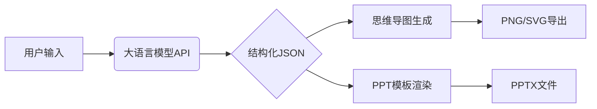

# Text2PPT - 智能PPT生成工具

[](https://opensource.org/licenses/MIT)
[](https://www.python.org/)

## 📌 核心功能
- 自然语言需求解析（支持deepseek-chat）
- 自动生成结构化大纲
- 可视化思维导图生成
- PPT模板化输出
- 多格式文件持久化存储

## 🛠️ 技术架构


## 🚀 快速开始

### 安装步骤
```bash
# 克隆仓库
git clone https://github.com/<your-username>/Text2PPT.git

# 安装依赖
brew install graphviz nodejs  # macOS
apt-get install graphviz     # Linux
npm install -g mermaid.cli
pip install -r requirements.txt

# 配置环境变量
echo "OPENAI_API_KEY=your_key" > .env
```

### 运行程序
```bash
# 本地运行
python main.py --input "需求描述" --style professional

# Docker运行
docker compose build
docker compose up
```

## 📂 输出示例
```
output/
├── 20240520_153022/
│   ├── requirement.json
│   ├── mindmap.svg
│   └── presentation.pptx
```

## 📜 许可证
MIT License - 详见 [LICENSE](LICENSE)


