# Text2PPT - 智能PPT生成工具

[](https://opensource.org/licenses/MIT)
[](https://www.python.org/)

## 📌 核心功能
- 自然语言需求解析（支持deepseek-chat）
- 自动生成结构化大纲
- 可视化思维导图生成
- PPT模板化输出
- 多格式文件持久化存储

## 🛠️ 技术架构

```mermaid
graph LR
A[用户输入] --> B(大语言模型API)
B --> C{结构化JSON}
C --> D[思维导图生成]
C --> E[PPT模板渲染]
D --> F[PNG/SVG导出]
E --> G[PPTX文件]
```


## 🚀 快速开始

### 安装步骤
```bash
# 克隆仓库
git clone https://github.com/<your-username>/Text2PPT.git

# 安装依赖
brew install graphviz nodejs  # macOS
apt-get install graphviz     # Linux
npm install -g mermaid.cli
pip install -r requirements.txt

# 配置环境变量
echo "OPENAI_API_KEY=your_key" > .env
```

### 运行程序
```bash
# 本地运行
python main.py --input "需求描述" --style professional

# Docker运行
docker compose build
docker compose up
```

## 📂 输出示例
```
output/
├── 20240520_153022/
│   ├── requirement.json
│   ├── mindmap.svg
│   └── presentation.pptx
```

## 📜 许可证
MIT License - 详见 [LICENSE](LICENSE)


项目结构

Text2PPT/
├── src/
│   ├── llm_integration.py    # 大模型交互模块
│   ├── mindmap_generator.py  # 思维导图生成模块
│   └── ppt_generator.py      # PPT生成核心逻辑
├── config/
│   └── settings.py           # API密钥等配置
├── assets/
│   └── template.pptx         # PPT默认模板
├── tests/                    # 单元测试
├── docs/                     # 开发文档
├── output/                   # 生成文件目录（自动创建）
├── main.py                   # 主程序入口
├── Dockerfile
├── docker-compose.yml
├── requirements.txt
├── package.json              # Mermaid CLI依赖
├── .gitignore
└── README.md
